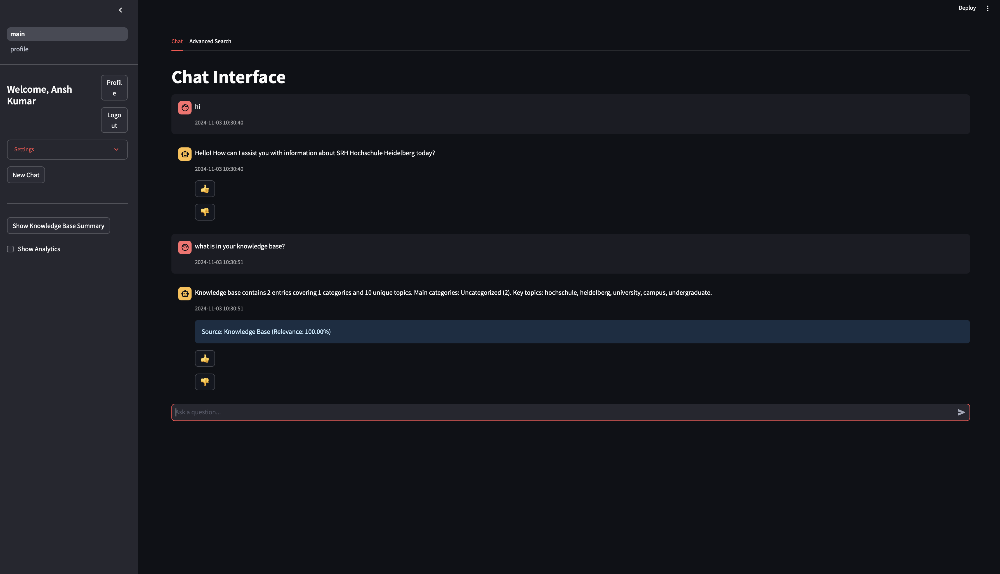
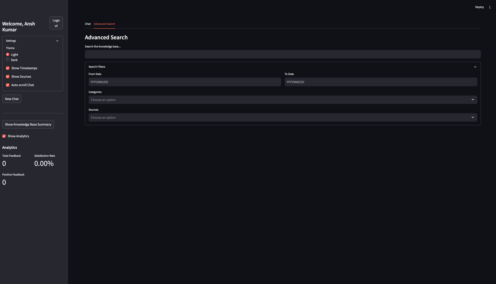

# Context-Aware Chatbot with LLaMA 3.1/3.2 Embeddings

## Overview

This project implements a context-aware chatbot using LLaMA 3.1/3.2 embeddings and a vector database for efficient query handling and response generation. The bot utilizes advanced Natural Language Processing (NLP) techniques such as entity extraction, intent recognition, and retrieval-augmented generation (RAG) to process domain-specific queries and generate accurate responses. The chatbot architecture is designed to handle complex queries by embedding large text datasets, storing embeddings in a vector database, and retrieving relevant context for response generation.

## Key Features
- LLaMA 3.1/3.2 Embeddings: Use of LLaMA 3.1/3.2 for generating text embeddings, enabling efficient semantic understanding of queries.
- Vector Database Integration: Embeddings stored and queried from a vector database (e.g., Pinecone, FAISS) for fast similarity-based retrieval.
- NLP Techniques: Entity extraction, intent recognition, and context-based response generation.
- Retrieval-Augmented Generation (RAG): The chatbot retrieves relevant text from a database and generates responses using the LLaMA 3.1/3.2 model, ensuring context-aware interaction.
- Web Interface: A web application interface to interact with the chatbot.

##  Search


## Architecture Overview

The chatbot system is built around a modular architecture consisting of several key components:

### 1. Data Collection and Preprocessing

- Data Collection: Scraping of domain-specific data (e.g., university resources, academic policies) using web scraping techniques.
- Preprocessing:
- Cleaning: Removing irrelevant text, correcting errors, and standardizing content.
- Tokenization: Breaking the text into words, sentences, or tokens for further NLP processing.
- Chunking: Splitting large text documents into manageable chunks for embedding.
### 2. NLP Processing

- Entity Extraction: Identifying key entities in the text, such as course names, deadlines, and policies.
- Intent Recognition: Classifying the user’s intent (e.g., asking for a deadline vs. asking for course information).
- Embedding: Using LLaMA 3.1/3.2 to generate embeddings for each chunk of preprocessed text. This represents the meaning of the text in a high-dimensional vector space.
### 3. Vector Database

- Storage: Embeddings are stored in a vector database for fast retrieval.
- Query: When a user submits a query, the chatbot converts the query into an embedding and searches the vector database for the most relevant text chunks.

### 4. Response Generation

- Contextual Retrieval: The chatbot retrieves the most relevant chunks from the vector database.
- LLaMA 3.1/3.2 for Response Generation: The chatbot uses the LLaMA 3.1/3.2 model to generate a response based on the context of the retrieved text chunks.

### 5. Web Application

- Frontend: A simple web interface allowing users to chat with the bot and receive real-time responses.
- Backend: The backend handles user queries, manages embeddings, and interfaces with the vector database and LLaMA 3.1/3.2 model.

##  Advance Search


## Technical Approach

### 1. Data Collection and Scraping

- Tools: Python, BeautifulSoup, Selenium
- Process: Data is scraped from university websites or other relevant sources containing course details, policies, FAQs, and academic documents.
- Data Types: Course syllabi, academic deadlines, university policies, study materials, etc.

### 2. Data Preprocessing

- Cleaning: Text normalization (lowercasing, punctuation removal, etc.).
- Tokenization: Using NLP libraries like SpaCy or NLTK.
- Chunking: Large text blocks are split into smaller, more manageable chunks for better embedding results.

### 3. Embeddings with LLaMA 3.1/3.2

- Model: LLaMA 3.1/3.2
- Process: Each chunk of preprocessed data is embedded using LLaMA 3.1/3.2, which converts the text into high-dimensional vectors representing semantic meaning.
- Tool: Ollama (local deployment of LLaMA models)

### 4. Vector Database for Retrieval

- Vector Database: We use Qdrant to store embeddings.
- Search: When a query is received, the chatbot generates an embedding for the query, and the database retrieves the most relevant text chunks by calculating similarity between the query embedding and the stored embeddings.

### 5. Response Generation with LLaMA 3.1/3.2

- LLaMA 3.1/3.2 is used to generate a response based on the context of the retrieved text. This is done by passing the relevant chunks along with the user query into the model.

## Installation

### Requirements

- Python 3.x
- Ollama (for LLaMA 3.1/3.2 model)
- Vector Database Qdrant
- Streamlit web application

## Setup

### 1. Clone the repository:

```bash
git clone https://github.com/ansh-info/QueryGPT.git
cd QueryGPT
```

### 2. Install dependencies:

```bash
pip install -r requirements.txt
```

### 3. Set up LLaMA 3.1/3.2, Qdrant, Postgresql:

- Run the yml file:

```bash
docker compose up -d
```

- Pull LLaMA 3.1/3.2 model(already specified in the docker yml):

```bash
docker exec -it ollama ollama pull nomic-embed-text
docker exec -it ollama ollama pull llama3.2
docker exec -it ollama ollama pull llama3.1
```

### 4. Set up vector database:

- We have used Qdrant as the vector database.
- Connect the database with your application and load embeddings.

### 5. Run the web application:

```bash
streamlit run app/main.py
```

### 6. Access the web application:

- Open a browser and navigate to Local URL: http://localhost:8501.

## Usage

- Open the web interface and interact with the chatbot by typing in queries.
- The chatbot will fetch relevant information from the vector database and generate context-aware responses using LLaMA 3.1/3.2.

## Performance Evaluation

The chatbot’s performance can be evaluated using the following metrics:

- Accuracy: Percentage of correct responses based on the relevance of the retrieved text.
- Response Time: Time taken for the chatbot to generate a response.
- User Satisfaction: Feedback from users to assess the chatbot’s effectiveness and conversational flow.

## Future Enhancements

- Fine-Tuning: Fine-tuning the LLaMA 3.1/3.2 model on domain-specific data for better response quality.
- Continuous Learning: Implementing a feedback loop for continuous learning and improvement.
- Multi-Modal Capabilities: Supporting input from other modalities such as voice or images.

## Contributing

##### 1. Fork the repository
##### 2. Create a new branch (`git checkout -b feature-branch`)
##### 3. Commit your changes (`git commit -am 'Add new feature`)
##### 4. Push to the branch (`git push origin feature-branch`)
##### 5. Open a pull request

## License

This project is licensed under the MIT License - see the [LICENSE](LICENSE) file for details.


